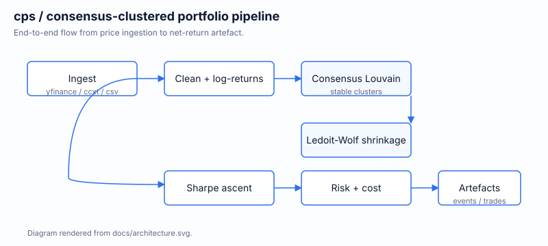

# Crypto Portfolio System

Consensus-clustered cryptocurrency portfolio construction, backtesting,
and serving — built on the framework in
[arXiv:2505.24831v2](https://arxiv.org/abs/2505.24831v2).



## What it does

`cps` (the `crypto-portfolio-system` package) ingests price data,
forecasts returns, builds rolling correlation networks, extracts
stable asset clusters via consensus Louvain community detection, then
performs Sharpe-ratio portfolio optimisation with covariance
regularisation, risk limits, and execution costs. It ships with a CLI,
a stateless FastAPI REST surface, and a production-ready Docker image.

## Quick Start

```bash
pip install crypto-portfolio-system
crypto-portfolio --output-dir outputs --run-dir runs
```

That produces `outputs/trades.csv`, `outputs/summary.csv`, and a
matching `events.jsonl` plus `metrics.json` on disk. Run `make help`
inside a clone for the full set of development commands.

## Repo

[github.com/sachncs/optimising-cryptocurrency-portfolios](https://github.com/sachncs/optimising-cryptocurrency-portfolios)
